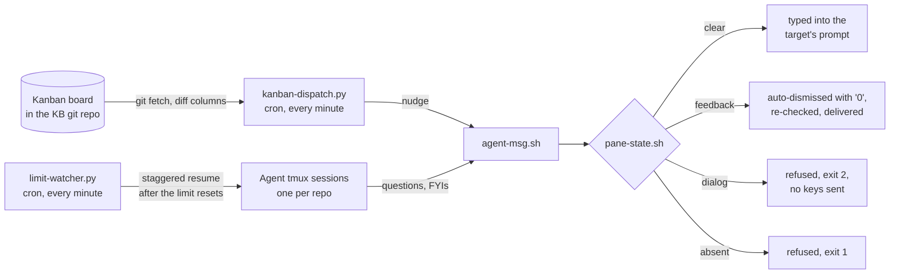

# agent-infra

Coordination infrastructure for a fleet of Claude Code agents: board dispatching, live messaging, and usage-limit auto-resume. **Owner:** Luca Bettermann.

## What it does and why

The working model is one context-rich expert agent per repository, each in a long-lived named tmux session, with a shared kanban board (a markdown file in a git repo) as the durable work queue. That model needs plumbing: something must turn board moves into nudges, carry live questions between agents, and bring sessions back after the usage limit. This repo is that plumbing, three small pieces with no daemon and no database:



Everything is deliberately transport, not storage: the board is the only durable queue, and a message that cannot be delivered fails loudly instead of landing in an inbox. A nudge an agent misses is recovered by reconciling from the board, never replayed from a spool.

## Setup

Prerequisites: Linux with tmux, git, python3, perl, and cron. `notify-send` is used for user-facing review pings if present. Everything runs as the agent user; only the optional wiki mount needs sudo.

```sh
git clone git@github.com:luca-bettermann/multi-agent-infra.git ~/projects/agent-infra
cd ~/projects/agent-infra
cp sessions.conf.example sessions.conf          # then fill in your fleet

# command symlinks (~/.local/bin is assumed on PATH)
ln -s "$PWD/agent-msg.sh"   ~/.local/bin/agent-msg
ln -s "$PWD/auto-resume.sh" ~/.local/bin/auto-resume

# dispatcher + limit watcher, once per minute
crontab -e
#   PATH=/usr/local/bin:/usr/bin:/bin
#   * * * * * flock -n /tmp/kdispatch.lock env DRY_RUN=0 KB_DIR=$HOME/path/to/knowledge-base python3 $HOME/projects/agent-infra/kanban-dispatch.py >> $HOME/projects/agent-infra/dispatch.log 2>&1
#   * * * * * flock -n /tmp/limit-watcher.lock python3 $HOME/projects/agent-infra/limit-watcher.py >> $HOME/projects/agent-infra/limit-watcher.log 2>&1
```

The dispatcher is safe by default: without `DRY_RUN=0` it only logs what it would do, and its first live run just records a baseline. `python3 kanban-dispatch.py --preview` shows the routing for the current board without touching anything.

## Configuration

One file, plain text, deployment-specific and gitignored; copy it from its `.example` template and fill in your fleet:

**`sessions.conf`** maps board scope tags to tmux sessions, one `tag session` pair per line. The first scope tag on a card decides the owning session; a tag not in this file is logged and not routed, there is no catch-all. This file is the authoritative routing map; consult it, never a copy of it.

`mount-wiki.sh` optionally bind-mounts one canonical clone of a shared team wiki read-only into every agent's knowledge base checkout, so shared documentation has a single synchronized copy.

Dispatcher environment: `KB_DIR` is required (the knowledge-base clone whose `origin/main` holds the board); `SESSIONS_CONF`, `KDISPATCH_STATE`, and `DRY_RUN` are optional overrides. `mount-wiki.sh` takes `WIKI_CANON` to point at a different canonical wiki clone.

## Commands

```sh
agent-msg <target> <message...>    # live message into another agent's prompt
                                   # target: session name or scope tag (sessions.conf)
auto-resume on|off                 # master switch for the limit watcher
auto-resume enable|disable <sess>  # enroll or unenroll a session
auto-resume status                 # master state, enrolled set, cron, recent log
python3 kanban-dispatch.py --preview   # read-only routing preview
./mount-wiki.sh                        # mount the wiki into all agent KBs
bash tests/test_pane_state.sh          # test suite
```

## Core concepts

### The board is the durable queue

The dispatcher polls `origin/main` of the knowledge-base repo, diffs the board between the last seen commit and the new one, and fires on four column events: a card entering `open` nudges the owning session, `review` notifies the user, `review` back to `in progress` hands a card back to its agent, and `cleanup` on a card carrying `#from/<scope>` calls back the scope that handed it off. Every nudge is a live accelerator and nothing more. Sessions reconcile their queue from the board on wake, so a missed nudge costs latency, never work.

### Message delivery semantics

`agent-msg` types the message into the target's live tmux prompt and submits it. An idle target gets it immediately. A generating target gets it too: Claude Code queues input typed mid-generation and hands it over at the next prompt boundary, so senders never wait for idle. The periodic feedback prompt is handled on the sender's behalf: it holds no content decision, so agent-msg dismisses it (a single `0` keypress), re-checks the pane, and delivers normally. Delivery is refused in exactly two cases, both explicit: the session does not exist (exit 1), or the pane shows an answer-consuming content dialog such as a permission prompt, AskUserQuestion, or plan approval (exit 2, and no keys are sent, because injected text plus Enter could answer the dialog as a phantom choice). There is deliberately no durable inbox, spool, or retry daemon behind any of this; on refusal the sender is told what to do instead.

The pane classification (`absent | feedback | dialog | clear`) lives in one place, `pane-state.sh`, shared by `agent-msg` and the dispatcher so the two cannot drift. Detection is positive-only dialog chrome; mere busyness never blocks delivery. `DIALOG_RE` in that script is the tunable part, extended as new dialog signatures appear. `pane-state.sh --classify` reads a captured screen from stdin, which is what makes the semantics testable offline.

### Cross-repo knowledge flows through agents, not checkouts

Agents hold no copies of each other's repositories. Cross-repo information is a question to the repository's own agent, whose warm context answers cheaper and better than a cold read of foreign source; an actual code dependency is a pinned git reference in the consumer's environment, never a checkout of the owner's working tree. The ownership boundary is enforced by absence: what an agent does not have, it cannot fork context from or write to.

Two refinements keep the rule honest at its edges. A repository with no owning agent has nobody to ask, so its remote is the source: read it there or through a throwaway clone, and distil any load-bearing facts into your own documentation with the remote URL cited. And a deployment-composition dependency (one stack including another repo's deploy files, such as a compose `include:`) resolves against a dedicated sibling checkout in the consumer's deploy directory, the same way production does, never against the owning agent's live root: a live working tree moves under you, whatever branch the owner happens to have checked out.

### Auto-resume after the usage limit

The account-wide usage limit halts every session at once. `limit-watcher.py` passively captures each enrolled pane, recognises the limit screen, parses the reset time, and once it has passed injects a resume prompt, at most one session per tick so the fleet does not re-saturate the shared bucket in one burst. Detection and injection reuse the same passive-capture and send-keys patterns as the rest of the repo. Enrollment is explicit (`auto-resume enable <session>`), and the master switch is a kill file checked every tick.

## Tests and CI

`bash tests/test_pane_state.sh` covers the delivery contract end to end: canned-screen classification (idle with ghost text, generating, permission dialog, feedback prompt, numbered selectors, dialog words scrolled out of the input region) plus tmux integration with throwaway sessions for idle delivery, generating delivery, feedback auto-dismiss followed by delivery, dialog refusal with zero injected keys, and absent-session failure. GitHub Actions runs the same suite and a secret scan on every push.

## Deeper

Each script carries its full contract in its header comment; there is no separate context doc to drift. Deployment-specific bindings (which machine and which sessions) live with the deployment, in the gitignored `sessions.conf` and in the operator's own knowledge base, not in this repo.
