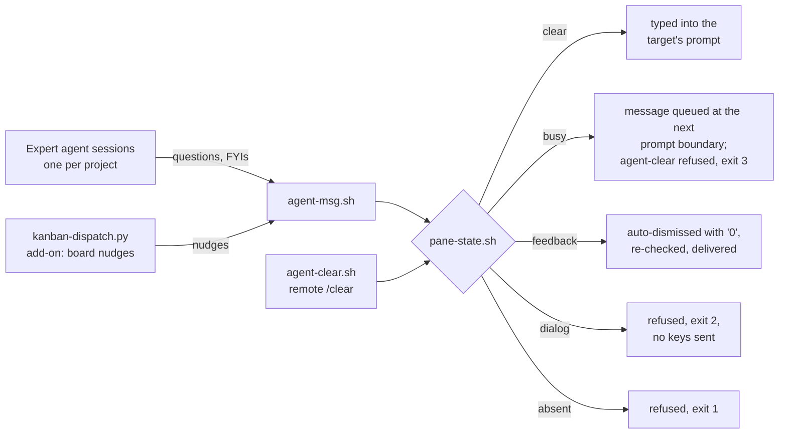

# agent-infra

Infrastructure for a fleet of expert Claude Code agents: a live inter-agent messaging core, with a board dispatcher as an add-on built on it. **Owner:** Luca Bettermann.

## What it does and why

The working model is a fleet of long-lived expert agents, one per project, each in a named tmux session holding its scope's context permanently. An agent may own one repository or several; every repository has exactly one owning agent. Because each expert keeps its context warm, cross-project knowledge flows as questions between agents rather than as source checkouts: the owner answers from context that already holds the why, the gotchas, and the current state, which is cheaper and more reliable than a cold read of foreign code.

The core of this repo is the messaging layer that makes those questions work: `agent-msg` delivers straight into another agent's live prompt, and `pane-state.sh` classifies the target pane so delivery is safe. Everything else is an add-on riding on that core: a dispatcher that turns kanban-board moves into nudges (the board is one choice of work queue; the messaging does not depend on it).



Everything is deliberately transport, not storage: a message that cannot be delivered fails loudly instead of landing in an inbox, and the durable state lives wherever the deployment keeps its work queue.

## Setup

Prerequisites: Linux with tmux, git, python3, perl, and cron. `notify-send` is used for user-facing review pings if present. Everything runs unprivileged as the agent user.

```sh
git clone git@github.com:luca-bettermann/multi-agent-infra.git ~/projects/agent-infra
cd ~/projects/agent-infra
cp sessions.conf.example sessions.conf          # then fill in your fleet

# core: the messaging command (~/.local/bin is assumed on PATH)
ln -s "$PWD/agent-msg.sh" ~/.local/bin/agent-msg
ln -s "$PWD/agent-clear.sh" ~/.local/bin/agent-clear

# add-on: board dispatcher (once per minute)
#   * * * * * flock -n /tmp/kdispatch.lock env DRY_RUN=0 KB_DIR=$HOME/path/to/knowledge-base python3 $HOME/projects/agent-infra/kanban-dispatch.py >> $HOME/projects/agent-infra/dispatch.log 2>&1
```

Cron needs `PATH=/usr/local/bin:/usr/bin:/bin` set at the top of the crontab. The dispatcher is safe by default: without `DRY_RUN=0` it only logs what it would do, and its first live run just records a baseline. `python3 kanban-dispatch.py --preview` shows the routing for the current board without touching anything.

## Configuration

One file, plain text, deployment-specific and gitignored; copy it from its `.example` template and fill in your fleet:

**`sessions.conf`** maps scope tags to tmux sessions, one `tag session` pair per line. Several tags may map to the same session (an agent owning several repositories); each tag has exactly one session. The dispatcher routes a card by its first scope tag; a tag not in this file is logged and not routed, there is no catch-all. This file is the authoritative routing map; consult it, never a copy of it.

Dispatcher environment: `KB_DIR` is required (the git clone whose `origin/main` holds the board); `SESSIONS_CONF`, `KDISPATCH_STATE`, and `DRY_RUN` are optional overrides.

## Commands

```sh
agent-msg <target> <message...>    # live message into another agent's prompt
                                   # target: session name or scope tag (sessions.conf)
agent-clear <target>               # clear that agent's conversation context (/clear)
python3 kanban-dispatch.py --preview   # read-only routing preview
bash tests/test_pane_state.sh          # test suite
```

## Core concepts

### Expert agents, warm context, ownership by absence

Each agent is the standing expert for its project and holds no copies of any other agent's repositories. Cross-project information is a question to the owning agent; a code dependency on another agent's repository is a pinned git reference in the consumer's own environment, whose installed source is fair to read because it is versioned and pinned. The ownership boundary is enforced by absence: what an agent does not have, it cannot fork context from or write to.

The same logic covers the edges. A repository with no owning agent has nobody to ask, so its remote is the source: read it there or through a throwaway clone, and distil any load-bearing facts into your own documentation with the remote URL cited. A deployment-composition dependency (one stack including another repository's deploy files, such as a compose `include:`) resolves against a dedicated sibling checkout in the consumer's deploy directory, the same way production does, never against the owning agent's live working tree: a live tree moves under you, whatever branch the owner happens to have checked out.

### Message delivery semantics

`agent-msg` types the message into the target's live tmux prompt and submits it. An idle target receives it immediately. A generating target receives it as well: Claude Code queues input typed mid-generation and hands it over at the next prompt boundary, so senders send without waiting. The periodic feedback prompt is handled on the sender's behalf: it holds no content decision, so agent-msg dismisses it with a single `0` keypress, re-checks the pane, and delivers. Delivery is refused in exactly two cases, both explicit: the session does not exist (exit 1), or the pane shows an answer-consuming content dialog such as a permission prompt, AskUserQuestion, or plan approval (exit 2, with no keys sent, because injected text plus Enter could answer the dialog as a phantom choice). There is deliberately no durable inbox, spool, or retry daemon behind any of this; on refusal the sender is told what to do instead.

The pane classification (`absent | feedback | dialog | busy | clear`) lives in one place, `pane-state.sh`, shared by `agent-msg`, `agent-clear`, and the dispatcher so they cannot drift. Detection is positive-only chrome — dialog markers, and for `busy` the `esc to interrupt` hint Claude Code shows only while it is generating. Busyness is still not a blocking state for messages: `agent-msg` refuses on `absent` and `dialog` alone and delivers to a busy pane exactly as before. `DIALOG_RE` and `BUSY_RE` in that script are the tunable parts, extended as new signatures appear. `pane-state.sh --classify` reads a captured screen from stdin, which is what makes the semantics testable offline.

### Clearing a session's context

`agent-clear <target>` frees a long-lived agent from a context window it has outgrown, by typing Claude Code's own `/clear` into the target's prompt. It cannot go through `agent-msg`: that prefixes every message with `[agent-msg from <sender>]`, so the target reads the slash command as chat and answers it. So `agent-clear` sends the raw keystrokes itself, one session at a time, and nothing else. It refuses on the same absent (exit 1) and dialog (exit 2) states as messaging, and additionally on `busy` (exit 3), because a generating pane queues typed input for the next prompt boundary, where `/clear` would land as chat text rather than as a command. After sending it polls the pane for the proof of a real clear — a freshly reprinted `Claude Code v…` banner with the submitted `❯ /clear` echoed beneath it — and prints `cleared '<session>'` only on seeing one; an unconfirmed clear fails loudly (exit 4) instead of being assumed. `agent-clear --verify` runs that check against a captured screen on stdin, so it is testable offline like the classifier.

## Add-ons

### Board dispatcher

One deployment's choice of durable work queue is a kanban board: a markdown file in a git repo, columns as headings, cards as lines. The dispatcher polls the clone's `origin/main`, diffs the board between the last seen commit and the new one, and fires on four column events: a card entering `open` nudges the owning session, `review` notifies the user, `review` back to `in progress` hands a card back to its agent, and `cleanup` on a card carrying `#from/<scope>` calls back the scope that handed it off. Every nudge goes through `agent-msg` and is a live accelerator, nothing more: sessions reconcile their queue from the board on wake, so a missed nudge costs latency, never work. A different queue with git-diffable state could drive the same dispatcher pattern.

This add-on is **strictly optional, and off by default**. Because sessions already reconcile from the board on wake and resume, and `agent-msg` already carries any notification that must land now, a deployment can run on reconcile-plus-direct-messaging alone — and some deliberately do, since automatic board-move nudges are more often noise than signal. Enable the dispatcher only if you want the latency shaved off routine transitions; skip it and lose nothing durable.

### Resuming after the usage limit

The account-wide usage limit is now handled by Claude Code itself (`autoContinueAtUsageLimit`); this repo no longer ships a watcher for it.

## Tests and CI

`bash tests/test_pane_state.sh` covers the delivery contract end to end: canned-screen classification (idle with ghost text, generating spinner and status-bar hint, permission dialog, feedback prompt, numbered selectors, marker words scrolled out of the input region) plus tmux integration with throwaway sessions for idle delivery, generating delivery, feedback auto-dismiss followed by delivery, dialog refusal with zero injected keys, and absent-session failure. `agent-clear` is covered the same way: post-clear verification against a screen captured from a live session, its refusals on absent, dialog, and busy panes with zero injected keys, an unconfirmed clear failing loudly, and a confirmed one reporting success. GitHub Actions runs the same suite and a secret scan on every push.

## Deeper

Each script carries its full contract in its header comment; there is no separate context doc to drift. Deployment-specific bindings (which machine and which sessions) live with the deployment, in the gitignored `sessions.conf` and in the operator's own knowledge base, not in this repo.
